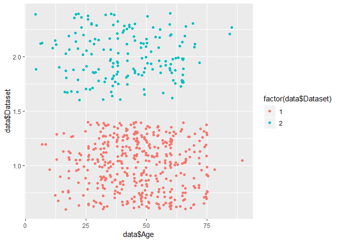
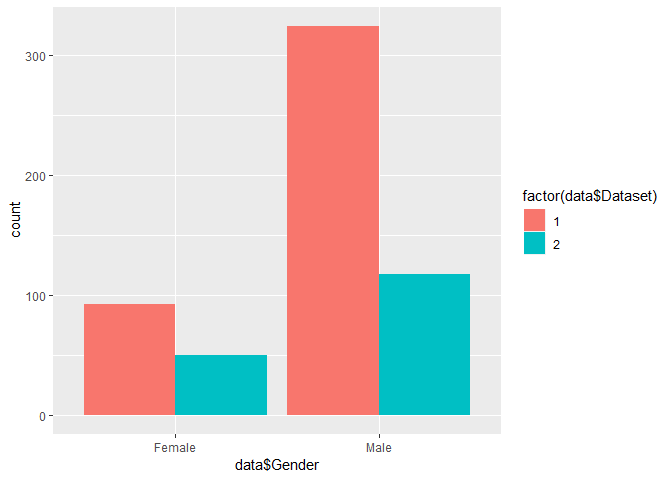
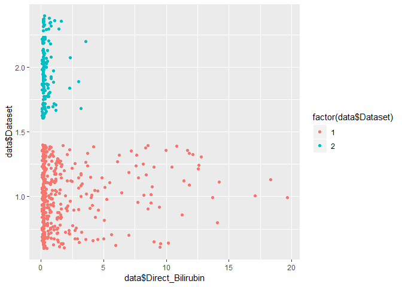
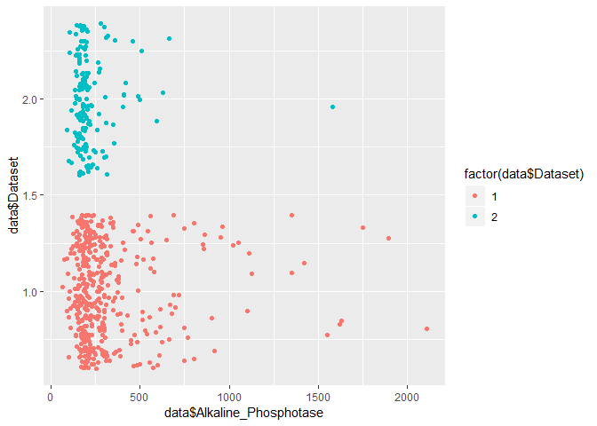
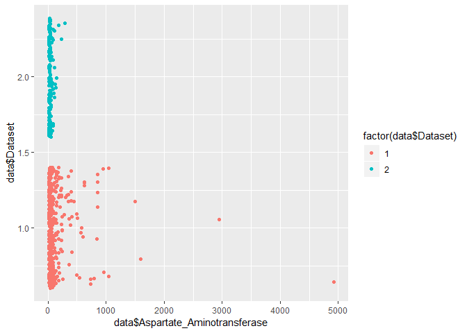
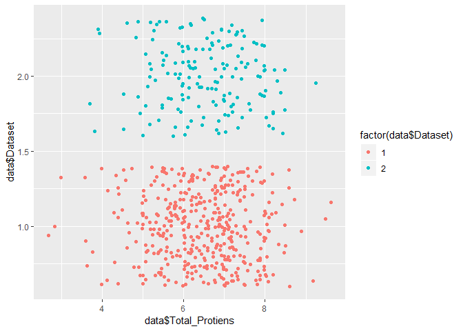
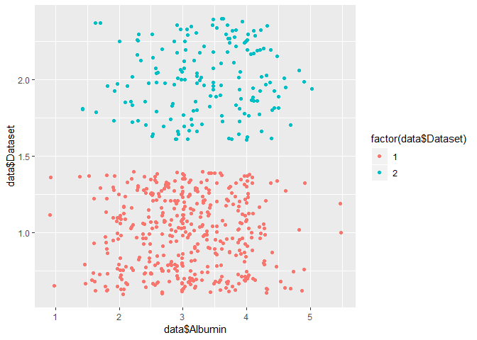
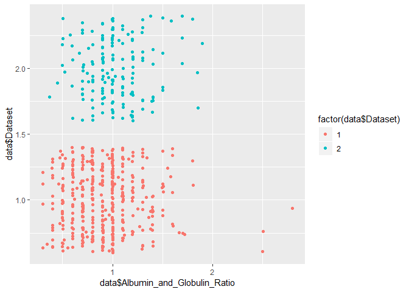
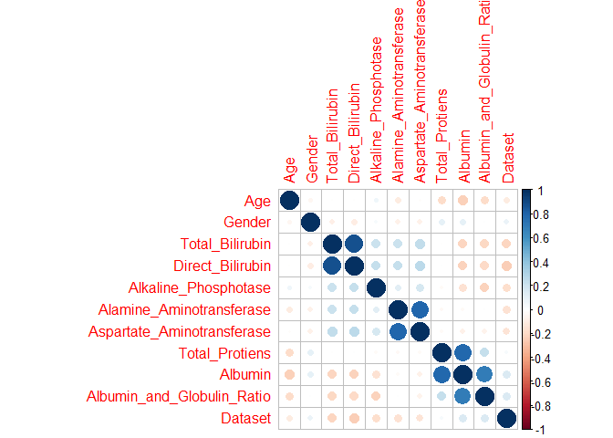
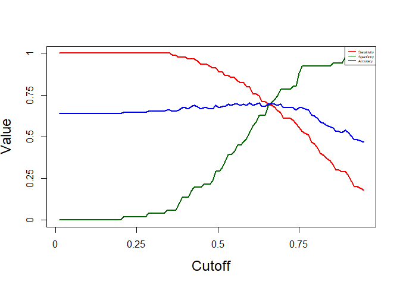

Indian Liver Patient Records
================

Introduction
------------

This dataset is downloaded from kaggle website. <https://www.kaggle.com/uciml/indian-liver-patient-records>

The dataset contains 416 liver patient records and 167 non liver patient records. The dataset has 10 medical parameters of the patients which can be used in modeling the machine learning algorithm for predicting the chances of liver disease. The 11th variable "Dataset" is the class label which divides the patients to liver diseased or not.

``` r
# Start with loading the libraries
library(ggplot2)
library(corrplot)
library(randomForest)
library(caret)
```

``` r
# Load the data
load("rdas/data.rda")
```

Aim here is to: Explore the dataset and the variables, Clean the data, Prepare the variable for modeling

``` r
head(data)
```

    ##   Age Gender Total_Bilirubin Direct_Bilirubin Alkaline_Phosphotase
    ## 1  65 Female             0.7              0.1                  187
    ## 2  62   Male            10.9              5.5                  699
    ## 3  62   Male             7.3              4.1                  490
    ## 4  58   Male             1.0              0.4                  182
    ## 5  72   Male             3.9              2.0                  195
    ## 6  46   Male             1.8              0.7                  208
    ##   Alamine_Aminotransferase Aspartate_Aminotransferase Total_Protiens
    ## 1                       16                         18            6.8
    ## 2                       64                        100            7.5
    ## 3                       60                         68            7.0
    ## 4                       14                         20            6.8
    ## 5                       27                         59            7.3
    ## 6                       19                         14            7.6
    ##   Albumin Albumin_and_Globulin_Ratio Dataset
    ## 1     3.3                       0.90       1
    ## 2     3.2                       0.74       1
    ## 3     3.3                       0.89       1
    ## 4     3.4                       1.00       1
    ## 5     2.4                       0.40       1
    ## 6     4.4                       1.30       1

``` r
str(data)
```

    ## 'data.frame':    583 obs. of  11 variables:
    ##  $ Age                       : int  65 62 62 58 72 46 26 29 17 55 ...
    ##  $ Gender                    : chr  "Female" "Male" "Male" "Male" ...
    ##  $ Total_Bilirubin           : num  0.7 10.9 7.3 1 3.9 1.8 0.9 0.9 0.9 0.7 ...
    ##  $ Direct_Bilirubin          : num  0.1 5.5 4.1 0.4 2 0.7 0.2 0.3 0.3 0.2 ...
    ##  $ Alkaline_Phosphotase      : int  187 699 490 182 195 208 154 202 202 290 ...
    ##  $ Alamine_Aminotransferase  : int  16 64 60 14 27 19 16 14 22 53 ...
    ##  $ Aspartate_Aminotransferase: int  18 100 68 20 59 14 12 11 19 58 ...
    ##  $ Total_Protiens            : num  6.8 7.5 7 6.8 7.3 7.6 7 6.7 7.4 6.8 ...
    ##  $ Albumin                   : num  3.3 3.2 3.3 3.4 2.4 4.4 3.5 3.6 4.1 3.4 ...
    ##  $ Albumin_and_Globulin_Ratio: num  0.9 0.74 0.89 1 0.4 1.3 1 1.1 1.2 1 ...
    ##  $ Dataset                   : int  1 1 1 1 1 1 1 1 2 1 ...

Can appreciate the data dimensions, variables and the class

Explore the label column

``` r
table(data$Dataset)
```

    ## 
    ##   1   2 
    ## 416 167

Missing values

``` r
sapply(data, function(x) sum(is.na(x)))
```

    ##                        Age                     Gender 
    ##                          0                          0 
    ##            Total_Bilirubin           Direct_Bilirubin 
    ##                          0                          0 
    ##       Alkaline_Phosphotase   Alamine_Aminotransferase 
    ##                          0                          0 
    ## Aspartate_Aminotransferase             Total_Protiens 
    ##                          0                          0 
    ##                    Albumin Albumin_and_Globulin_Ratio 
    ##                          0                          4 
    ##                    Dataset 
    ##                          0

Only 4 missing values

EDA and cleaning of variables. EDA helps to get insight to the spread of variables

Cleaning variable Age

``` r
table(data$Age)
```

    ## 
    ##  4  6  7  8 10 11 12 13 14 15 16 17 18 19 20 21 22 23 24 25 26 27 28 29 30 
    ##  2  1  2  1  1  1  2  4  2  1  3  5 11  2  3  7  9  3  5  5 14  6  8  7 10 
    ## 31 32 33 34 35 36 37 38 39 40 41 42 43 44 45 46 47 48 49 50 51 52 53 54 55 
    ##  8 20 15  8 12 11  9 21  6 17  5 21  4  3 25 16  6 20 11 23 10  7  6  8 18 
    ## 56 57 58 60 61 62 63 64 65 66 67 68 69 70 72 73 74 75 78 84 85 90 
    ##  4  7 14 34  5  9  2  6 17 12  1  4  2  9  8  2  4 14  1  1  1  1

Patient age spread across 4-90 yrs

``` r
ggplot(data, aes(data$Age,fill=factor(data$Dataset))) + geom_bar(position = "dodge")
```


``` r
ggplot(data, aes(data$Age, data$Dataset, color=factor(data$Dataset))) + 
  geom_point(position = "jitter")
```



The points are given different colors to different label in Dataset variable. "jitter" helps spread the points and help appreciated the spread. This can be grouped in to few age categories. Levels are reduced to 7 categories here.

``` r
data$Age <- replace(data$Age, data$Age <=12, "1")
data$Age <- replace(data$Age, data$Age >12 & data$Age <=18, "2")
data$Age <- replace(data$Age, data$Age >18 & data$Age <=40, "3")
data$Age <- replace(data$Age, data$Age >40 & data$Age <=55, "4")
data$Age <- replace(data$Age, data$Age >55 & data$Age <=65, "5")
data$Age <- replace(data$Age, data$Age >65 & data$Age <=75, "6")
data$Age <- replace(data$Age, data$Age >75, "7")
table(data$Age)
```

    ## 
    ##   1   3   4   5   6   7 
    ##  10 232 183  98  56   4

Type of variable is changed to integer for modeling

``` r
class(data$Age)
```

    ## [1] "character"

``` r
data$Age <- as.integer(data$Age)
```

Cleaning for variable Gender

``` r
table(data$Gender)
```

    ## 
    ## Female   Male 
    ##    142    441

``` r
ggplot(data, aes(data$Gender,fill=factor(data$Dataset))) + geom_bar(position = "dodge")
```



Males have higher diseased proportion

Converting the variable to integer

``` r
data$Gender <- replace(data$Gender, data$Gender == "Male", "1")
data$Gender <- replace(data$Gender, data$Gender == "Female", "2")
data$Gender <- as.integer(data$Gender)
```

Exploring the variable Total\_Bilirubin

``` r
ggplot(data, aes(data$Total_Bilirubin, data$Dataset, color=factor(data$Dataset))) + 
  geom_point(position = "jitter")
```


Can appreciate the spread of values. Normal Total bilirubin value ranges between : 0.1 to 1.2 mg/dL (1.71 to 20.5 µmol/L). High increase in values can be seen, which even reaches 60mg/dl and above in diseased group

``` r
tapply(data$Total_Bilirubin, data$Dataset, mean, na.rm=TRUE)
```

    ##        1        2 
    ## 4.164423 1.142515

The mean value also is very high in diseased group

Exploring the variable Direct\_Bilirubin

``` r
ggplot(data, aes(data$Direct_Bilirubin, data$Dataset, color=factor(data$Dataset))) + 
  geom_point(position = "jitter")
```



Appreciate the spread and mean values in two groups

``` r
tapply(data$Direct_Bilirubin, data$Dataset, mean, na.rm=TRUE)
```

    ##         1         2 
    ## 1.9235577 0.3964072

Normal level of Direct bilirubin: less than 0.3 mg/dL (less than 5.1 µmol/L). High mean value of 1.9 is seen in diseased grouped when the normal value is less than 0.3mg/dl

Explore variable Alkaline\_Phosphotase

``` r
ggplot(data, aes(data$Alkaline_Phosphotase, data$Dataset, color=factor(data$Dataset))) + 
  geom_point(position = "jitter")
```



``` r
tapply(data$Alkaline_Phosphotase, data$Dataset, mean, na.rm=TRUE)
```

    ##        1        2 
    ## 319.0072 219.7545

Normal range for serum ALP level is 20 to 140 IU/L

Explore the variable Alamine\_Aminotransferase

``` r
ggplot(data, aes(data$Alamine_Aminotransferase, data$Dataset, color=factor(data$Dataset))) + 
  geom_point(position = "jitter")
```


``` r
tapply(data$Alamine_Aminotransferase, data$Dataset, mean, na.rm=TRUE)
```

    ##        1        2 
    ## 99.60577 33.65269

Normal values for ALT between 7 to 56 units per liter

Explore the variable Aspartate\_Aminotransferase

``` r
ggplot(data, aes(data$Aspartate_Aminotransferase, data$Dataset, color=factor(data$Dataset))) + 
  geom_point(position = "jitter")
```



``` r
tapply(data$Aspartate_Aminotransferase, data$Dataset, mean, na.rm=TRUE)
```

    ##         1         2 
    ## 137.69952  40.68862

Normal AST is reported between 10 to 40 units per liter

Explore the variable Total\_Protiens

``` r
ggplot(data, aes(data$Total_Protiens, data$Dataset, color=factor(data$Dataset))) + 
  geom_point(position = "jitter")
```



``` r
tapply(data$Total_Protiens, data$Dataset, mean, na.rm=TRUE)
```

    ##        1        2 
    ## 6.459135 6.543114

Normal range for total protein is between 6 and 8.3 grams per deciliter (g/dL).

Explore the variable Albumin

``` r
ggplot(data, aes(data$Albumin, data$Dataset, color=factor(data$Dataset))) + 
  geom_point(position = "jitter")
```



``` r
tapply(data$Albumin, data$Dataset, mean, na.rm=TRUE)
```

    ##        1        2 
    ## 3.060577 3.344311

The normal range of Albumin is 3.5 to 5.5 g/dL or 35-55 g/liter.

Explore the variable Albumin\_and\_Globulin\_Ratio

``` r
ggplot(data, aes(data$Albumin_and_Globulin_Ratio, data$Dataset, color=factor(data$Dataset))) + 
  geom_point(position = "jitter")
```



``` r
tapply(data$Albumin_and_Globulin_Ratio, data$Dataset, mean, na.rm=TRUE)
```

    ##         1         2 
    ## 0.9141787 1.0295758

The normal A/G ratio is 0.8-2.0.

The variation in medical parameters could be the result of any medical condition or illness, from which the condition of liver disease needs to be differentiated.

Remove the observation with missing value. The 4 observation being very less in number are removed.

``` r
data<-na.omit(data)
```

Dimention of the dataset

``` r
dim(data)
```

    ## [1] 579  11

Find the correlation between variables in the dataset

``` r
data_cor <- round(cor(data, use="pairwise.complete.obs"), 2)
corrplot(data_cor)
```



Few of thoses varibales are correlated

Label column is converted to factor variable before modeling

``` r
data$Dataset <- as.factor(data$Dataset)
```

Set the seed to make the results repeateable

``` r
set.seed(123)
```

The dataset is divide to 75% train and 25% test observations. The train set is used to train the model and test set is used to validate the model performance.

``` r
indices <- sample(2, nrow(data), replace = T, prob = c(0.75, 0.25))
train <- data[indices == 1, ]
test <- data[indices == 2, ]
```

Modeling Random forest algorithm is used

``` r
set.seed(123)
rf.model <- randomForest(Dataset ~ ., data = train, do.trace = F)
```

Prediction

``` r
rf.predict <- predict(rf.model, test[,-11], type = "class")
```

Confusion matrix to get the idea of prediction against true labels

``` r
confusionMatrix(rf.predict, test$Dataset)
```

    ## Confusion Matrix and Statistics
    ## 
    ##           Reference
    ## Prediction  1  2
    ##          1 81 36
    ##          2  9 15
    ##                                           
    ##                Accuracy : 0.6809          
    ##                  95% CI : (0.5971, 0.7568)
    ##     No Information Rate : 0.6383          
    ##     P-Value [Acc > NIR] : 0.1676671       
    ##                                           
    ##                   Kappa : 0.2193          
    ##  Mcnemar's Test P-Value : 0.0001063       
    ##                                           
    ##             Sensitivity : 0.9000          
    ##             Specificity : 0.2941          
    ##          Pos Pred Value : 0.6923          
    ##          Neg Pred Value : 0.6250          
    ##              Prevalence : 0.6383          
    ##          Detection Rate : 0.5745          
    ##    Detection Prevalence : 0.8298          
    ##       Balanced Accuracy : 0.5971          
    ##                                           
    ##        'Positive' Class : 1               
    ## 

Let try to improve the model by improving the specificity which is very low in this model. It is important to avoid false positives. So need to tune the model.

Here the probability of falling to the 2 labelled groups are produced. We will try to find which cutoff probability will separate the cases to the 2 groups by giving importance to both the sensitivity and specificity. Currently the cutoff is set to 0.50 and with the help of plot a minimum value to the difference of sensitivity and specificity is calculated. Hopefully we expect this cutoff probability will help produce a balanced sensitivity and specificity and good overall accuracy.

Get probability

``` r
rf_predict <- data.frame(predict(rf.model, test[,-11], type = "prob"))
summary(rf_predict$X1)
```

    ##    Min. 1st Qu.  Median    Mean 3rd Qu.    Max. 
    ##  0.2060  0.5560  0.6860  0.6923  0.8460  0.9960

``` r
summary(rf_predict$X2)
```

    ##    Min. 1st Qu.  Median    Mean 3rd Qu.    Max. 
    ##  0.0040  0.1540  0.3140  0.3077  0.4440  0.7940

Get Predicition with 0.05 cutoff

``` r
predicted <- factor(ifelse(rf_predict$X1 >= 0.5, "1", "2"))
```

Create Function to produce confusion matrix values for a series of probabilities

``` r
perform_fn <- function(cutoff) 
{
  predicted <- factor(ifelse(rf_predict$X1 >= cutoff, "1", "2"))
  conf <- confusionMatrix(predicted, test$Dataset, positive = "1")
  acc <- conf$overall[1]
  sens <- conf$byClass[1]
  spec <- conf$byClass[2]
  out <- t(as.matrix(c(sens, spec, acc))) 
  colnames(out) <- c("sensitivity", "specificity", "accuracy")
  return(out)
}
```

Perform confusion matrix values for all values in 's'

``` r
s = seq(.01,.95,length=100)
OUT = matrix(0,100,3)
for(i in 1:100){
  OUT[i,] = perform_fn(s[i])
}
```

Plot the confusion matrix cutoff with accuracy, sensitivity and specificity values

``` r
plot(s, OUT[,1],xlab="Cutoff",ylab="Value",cex.lab=1.5,cex.axis=1.5,ylim=c(0,1),type="l",
     lwd=2,axes=FALSE,col=2)
axis(1,seq(0,1,length=5),seq(0,1,length=5),cex.lab=1.5)
axis(2,seq(0,1,length=5),seq(0,1,length=5),cex.lab=1.5)
lines(s,OUT[,2],col="darkgreen",lwd=2)
lines(s,OUT[,3],col=4,lwd=2)
box()
legend("topright",col=c(2,"darkgreen",4),lwd=c(1,1,1),
       c("Sensitivity","Specificity","Accuracy"), cex=0.4)
```



Pull the Cutoff value

``` r
cutoff <- s[which.min(abs(OUT[,1]-OUT[,2]))]
cutoff
```

    ## [1] 0.6556566

0.65565 seems to be good grouping probability value which can separate the patients in to diseased and non-diseased, with a balanced weightage to sensitivity & specificity and accuracy.

We hope to give good prediction on the disease status of a patient with this random forest algorithm by deciding on to be diseased, if the probability of prediction is above 0.655 and not diseased below the probability of 0.655

Let see the values with the probability of 0.655, the cutoff value.

``` r
test_cutoff <- factor(ifelse(rf_predict$X1 >= cutoff, "1", "2"))
```

``` r
conf_final <- confusionMatrix(test_cutoff, test$Dataset, positive = "1")
acc <- conf_final$overall[1]
sens <- conf_final$byClass[1]
spec <- conf_final$byClass[2]
acc
```

    ##  Accuracy 
    ## 0.6950355

``` r
sens
```

    ## Sensitivity 
    ##         0.7

``` r
spec 
```

    ## Specificity 
    ##   0.6862745

This seems to give a almost 70% accuracy in prediction of the patient status (diseased or not). Means we could predict the patient status with 70% accuracy.

Random forest gives the opportunity to find the importance of variable in prediction. Let us plot the variable importance. Gini index or the amount of disorder in the dataset when decreased to maximum, will produce a more homogenous nodes, or the datapoints in the resulting nodes will be more similar. So the feature or the variable which helps to give a better reduction in gini will have more importance in classifying the observations in the dataset

``` r
varImpPlot(rf.model)
```


Alkaline Phosphatase, Aspartate Aminotransferase and Alamine Aminotransferase are 3 most important variables in classfying the dataset. We already saw that the values of these variables in the 2 groups varied widly.
